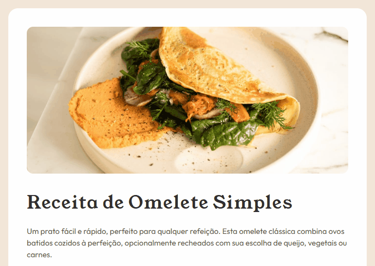

# Frontend Mentor - Solução para página de receitas

Esta é uma solução para o [Desafio da página de receitas no Frontend Mentor](https://www.frontendmentor.io/challenges/recipe-page-KiTsR8QQKm). Os desafios do Frontend Mentor ajudam você a melhorar suas habilidades de codificação construindo projetos realistas.

## Índice

- [Visão geral](#visão-geral)
    - [O desafio](#o-desafio)
    - [Captura de tela](#captura-de-tela)
    - [Links](#links)
- [Meu processo](#meu-processo)
    - [Construído com](#construído-com)
    - [O que aprendi](#o-que-aprendi)
- [Autor](#autor)

## Visão geral

### O desafio

Uma página de receitas que vai te ensinar a fazer uma omelete simples e saborosa, ideal para qualquer momento do dia. Com uma receita fácil de seguir, você vai preparar essa delícia em apenas 10 minutos! A combinação de ovos frescos, temperos a gosto e a possibilidade de adicionar recheios como queijo, vegetais ou carnes transforma a omelete em uma refeição versátil e nutritiva. Confira também a tabela nutricional para saber exatamente o que está consumindo. Perfeita para iniciantes ou para quem está com pressa, essa omelete vai conquistar todos os paladares!

### Captura de tela

[](https://jottaca.github.io/recipe-page-main/)
[](./screenshot.jpg)


### Links

- URL da solução: [https://github.com/JottaCa/recipe-page-main](https://github.com/JottaCa/recipe-page-main)
- URL do site ativo: [https://jottaca.github.io/recipe-page-main/](https://jottaca.github.io/recipe-page-main/)

## Meu processo

### Criado com

- Marcação HTML5 semântica
- Propriedades personalizadas CSS
- Flexbox

### O que aprendi

Ao resolver este projeto do Frontend Mentor, aprimorei várias habilidades essenciais para o desenvolvimento frontend, incluindo o uso de Flexbox para criar layouts responsivos e bem estruturados. Ganhei experiência em design responsivo com media queries, tornando as páginas adaptáveis a diferentes dispositivos. Além disso, desenvolvi boas práticas de controle de versão com Git, e organizei meu código para garantir maior manutenibilidade.

Um destaque foi o uso de variáveis CSS, que facilitam a personalização e modificação da página de forma rápida e eficiente, como no trecho a seguir:

```css
:root {
    --cor-de-fundo: hsl(30, 54%, 90%);
    --cor-de-fundo-recipe: hsl(0, 0%, 100%);
}
```
```css
body {
    background-color: var(--cor-de-fundo);
}

.recipe {
    background-color: var(--cor-de-fundo-recipe);
}
```

## Autor

- Site - [Jonathan Barbosa](https://jottaca.github.io/portfolio/)
- Mentor de front-end - [@devemdobro](https://github.com/devemdobro)